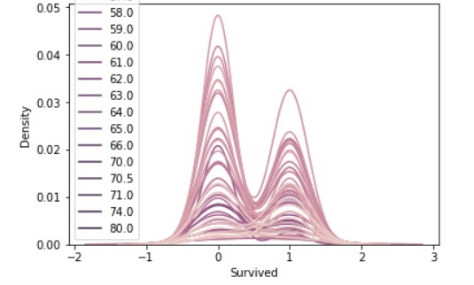

# A08-IMPLEMENT KDE PLOT WITH ANY ONE OF YOUR OWN DATA SET


## CODE:
```
Program Developed By: R.SOMEASVAR 
Register Number: 212221230103
```
```
import pandas as pd
import numpy as np
import matplotlib.pyplot as plt
import seaborn as sns

df=pd.read_csv("titanic_dataset.csv")

df

#Create KDE for all the numeric variables in dataframe
sns.kdeplot(data=df)

sns.kdeplot(data=df, x='Pclass')

sns.kdeplot(data=df, x='Age')

sns.kdeplot(data=df, x='Fare')

sns.kdeplot(data=df,x='Survived',hue='Sex')

sns.kdeplot(data=df,x='Fare',hue='Sex')

sns.kdeplot(data=df,x='Survived',hue='Age')

sns.kdeplot(data=df,x='SibSp',hue='Age')

sns.kdeplot(data=df,x='Survived',hue='Pclass')

#Stack KDE on a category using MULTIPLE argument
sns.kdeplot(data=df,x='Survived',hue='Sex',multiple='stack')

sns.kdeplot(data=df,x='Survived',hue='Sex',multiple='stack',linewidth=5,palette='Dark2',alpha=0.5)

sns.kdeplot(data=df,x='Fare',hue='Sex',multiple='stack')

sns.kdeplot(data=df,x='Survived',hue='Pclass',multiple='stack')

sns.kdeplot(data=df,x='Survived',hue='Pclass',multiple='stack',linewidth=5,palette='Dark2',alpha=0.5)

sns.kdeplot(data=df,x='Fare',hue='Pclass',multiple='stack')

#Create a bivariate KDE
sns.kdeplot(data=df, x='Survived',y='SibSp')

sns.kdeplot(data=df, x='Survived',y='Fare')

sns.kdeplot(data=df, x='Age',y='Fare')

sns.kdeplot(data=df, x='Age',y='Pclass')

```
# OUTPUT:
# Initial Dataframe:

# KDE for all numeric variables of the Dataframe:

## Basic KDE plot for Pclass column:

## Basic KDE plot for Age column:

## Basic KDE plot for Fare column:

## Basic KDE plot for Survived column:

## Basic KDE plot for SibSp column:

# KDE on a category using MULTIPLE argument:
## Survived Vs Sex:

## Fare Vs Sex:

## Survived Vs Pclass:

# KDE on a category using MULTIPLE argument(Using additional Parameter- stack):
## Survived Vs Sex

## Fare Vs Sex

## Survived Vs Pclass:

## Fare Vs Pclass:

# KDE on a category using MULTIPLE argument(Using additional Parameter- stack,line width):
## Survived Vs Sex:

## Survived Pclass:


## Bivariate KDE:
## Survived Vs SibSp:

## Survived Vs Fare:

## Age Vs Fare:

## Age Vs Pclass:
